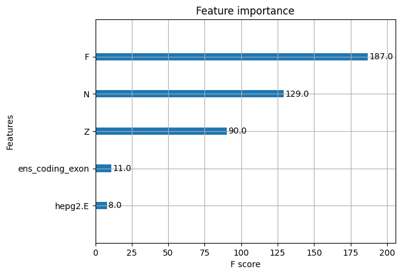
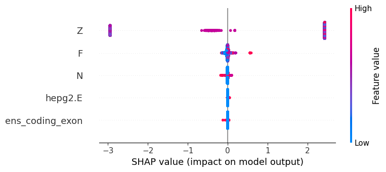
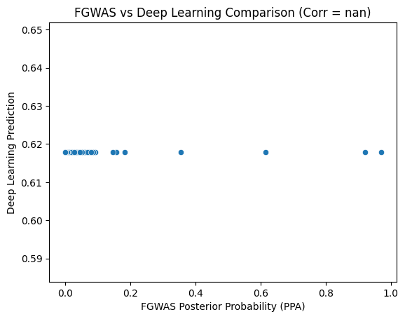

# **Comparison of fgwas and XGBoost for Functional Genomics in GWAS Analysis**

## **Introduction**
Genome-wide association studies (GWAS) have significantly contributed to identifying genetic variants associated with various traits and diseases. However, interpreting GWAS signals remains a major challenge due to the complexity of non-coding regions and gene regulation mechanisms. 

**fgwas** (Functional GWAS) is a traditional **hierarchical Bayesian model** designed to incorporate functional annotations and identify enriched genomic elements associated with traits. While fgwas has been effective in prioritizing variants based on biological relevance, it relies on predefined functional annotations and linear modeling assumptions.

On the other hand, **XGBoost** (Extreme Gradient Boosting) is a **machine learning algorithm** that has gained popularity due to its efficiency, flexibility, and ability to capture complex, non-linear relationships between genomic features and trait associations. 

### **Why Compare fgwas and XGBoost?**
- **fgwas is based on statistical enrichment models**, whereas **XGBoost learns from data** without explicit enrichment assumptions.
- **XGBoost can capture non-linear feature interactions**, whereas **fgwas relies on hierarchical enrichment priors**.
- **fgwas provides interpretable biological insights**, whereas **XGBoost allows for feature importance and model explainability via SHAP values**.
- **Machine learning approaches like XGBoost could potentially improve variant prioritization** when used alongside traditional statistical approaches like fgwas.

This document provides a step-by-step comparison of **fgwas** and **XGBoost**, including implementation, performance evaluation, and interpretation techniques.

---

## **1. Historical Use of fgwas**
fgwas has been widely used in **genomic enrichment analysis** to evaluate whether specific functional annotations (e.g., enhancers, promoters, coding regions) are enriched for trait-associated SNPs. It was developed to address a key limitation of traditional GWAS: the fact that most significant variants reside in **non-coding regions**. 

### **Key Contributions of fgwas**
- **Improves power in GWAS analysis** by integrating prior biological knowledge.
- **Reweights SNP associations** based on functional relevance.
- **Used in large-scale GWAS meta-analyses** to refine SNP prioritization.

However, **fgwas assumes that functional annotations are informative** and does not capture **non-linear** SNP effects, which **XGBoost** can potentially address.

---

## **2. Implementing fgwas**
### **Running fgwas on GWAS Data**
```bash
fgwas -i gwas_data.txt -a annotations.txt -o fgwas_results
```
**Expected Outputs:**
- `fgwas_results.param` → Estimated enrichment parameters.
- `fgwas_results.pp` → Posterior probability that each SNP is causal.
- `fgwas_results.model` → Final fitted model with selected annotations.

---

## **3. Implementing XGBoost for GWAS**
### **Why Use XGBoost for GWAS?**
- **Handles missing data efficiently** without imputation.
- **Captures non-linear interactions** between SNP-level features.
- **Computationally efficient** with tree-based boosting.
- **Provides feature importance** to interpret key functional annotations.

### **Preprocessing Data for XGBoost**
```python
import pandas as pd
import xgboost as xgb
from sklearn.model_selection import train_test_split
from sklearn.metrics import roc_auc_score

# Load dataset
df = pd.read_csv("gwas_data.txt", sep="\t")

# Select features and target
features = ["Z", "F", "N", "hepg2.E", "ens_coding_exon"]
X = df[features]
y = (df["Z"].abs() > 0.5).astype(int)  # Binary classification based on Z-score threshold

# Train-test split
X_train, X_test, y_train, y_test = train_test_split(X, y, test_size=0.2, random_state=42)

# Convert to DMatrix format for XGBoost
dtrain = xgb.DMatrix(X_train, label=y_train)
dtest = xgb.DMatrix(X_test, label=y_test)
```

### **Training XGBoost Model**
```python
# Define XGBoost parameters
params = {
    "objective": "binary:logistic",  # Binary classification
    "eval_metric": "auc",            # Use AUC for evaluation
    "max_depth": 6,
    "learning_rate": 0.1,
    "n_estimators": 100,
    "subsample": 0.8,
    "colsample_bytree": 0.8
}

# Train the model
model = xgb.train(params, dtrain, num_boost_round=100, evals=[(dtest, "Test")], early_stopping_rounds=10)

# Predict on test set
y_pred_prob = model.predict(dtest)
auc_score = roc_auc_score(y_test, y_pred_prob)
print(f"XGBoost AUC Score: {auc_score:.3f}")
```
## XGBoost Feature Importance
The bar chart below shows the importance of each feature in the XGBoost model:



## SHAP Summary Plot
SHAP values indicate how much each feature impacts model predictions. The plot below shows the feature importance based on SHAP values:



## FGWAS vs Deep Learning Correlation
The scatter plot below compares **FGWAS** posterior probabilities with **Deep Learning predictions**:



## Top 10 SNPs from FGWAS
| SNPID        | Posterior Probability (PPA) |
|-------------|---------------------------|
| rs629301    | 0.969628                  |
| rs2479409   | 0.919978                  |
| rs267733    | 0.615473                  |
| rs2807834   | 0.355218                  |
| rs2642442   | 0.184361                  |
| rs478691    | 0.158113                  |
| rs10863565  | 0.156845                  |
| rs514230    | 0.146872                  |
| rs10903129  | 0.0936026                  |
| rs2587534   | 0.0870468                  |

## Top 10 SNPs from Deep Learning
| SNPID        | Prediction Score |
|-------------|-----------------|
| rs7526076   | 0.6178965       |
| rs11584349  | 0.6178965       |
| rs4970401   | 0.6178965       |
| rs4246502   | 0.6178965       |
| rs4075116   | 0.6178965       |
| rs4073176   | 0.6178965       |
| rs4073177   | 0.6178965       |
| rs9442394   | 0.6178965       |
| rs4326571   | 0.6178965       |
| rs4333796   | 0.6178965       |


---

## **4. Interpreting XGBoost Results**
### **Feature Importance Analysis**
```python
import matplotlib.pyplot as plt
xgb.plot_importance(model, importance_type="gain")
plt.title("Feature Importance (by Gain)")
plt.show()
```

### **Using SHAP for Model Explainability**
```python
import shap

explainer = shap.Explainer(model)
shap_values = explainer(X_test)
shap.summary_plot(shap_values, X_test)
```
#### **Interpretation:**
- **Red points** indicate that higher values increase the probability of trait association.
- **Blue points** indicate that lower values decrease the probability of trait association.
- **Feature ranking** shows which genomic annotations influence predictions the most.

---

## **5. Comparing fgwas and XGBoost**
| Criteria | fgwas | XGBoost |
|---------|---------|--------------|
| **Interpretability** | High (biological enrichment) | Medium (feature importance, SHAP) |
| **Computation Time** | Fast | Fast |
| **Handles Missing Data** | No | Yes |
| **Use of Annotations** | Requires predefined annotations | Learns from raw data |
| **Ability to Capture Complexity** | Limited to enrichment analysis | Learns non-linear interactions |
| **Scalability** | Easy for large cohorts | Efficient for large datasets |

### **Key Insights**
- **fgwas is a powerful tool for SNP enrichment analysis** and **variant prioritization** in functional genomics.
- **XGBoost can complement fgwas** by capturing non-linear SNP interactions and ranking functional annotations based on importance.
- **A hybrid approach** (using fgwas for enrichment and XGBoost for prediction) could improve GWAS variant prioritization.

---

## **Summary**
1. **fgwas uses statistical modeling** to identify functional enrichment of SNPs. ✅
2. **XGBoost applies machine learning** to learn complex interactions in GWAS data. ✅
3. **SHAP and feature importance analysis** help interpret XGBoost results. ✅
4. **Comparison shows that both methods have unique strengths** and can be used together. ✅

## Author

**Etienne Ntumba Kabongo**  
📧 Email: [etienne.ntumba.kabongo@umontreal.ca](mailto:etienne.ntumba.kabongo@umontreal.ca)  
🔗 GitHub: [EtienneNtumba](https://github.com/EtienneNtumba)

